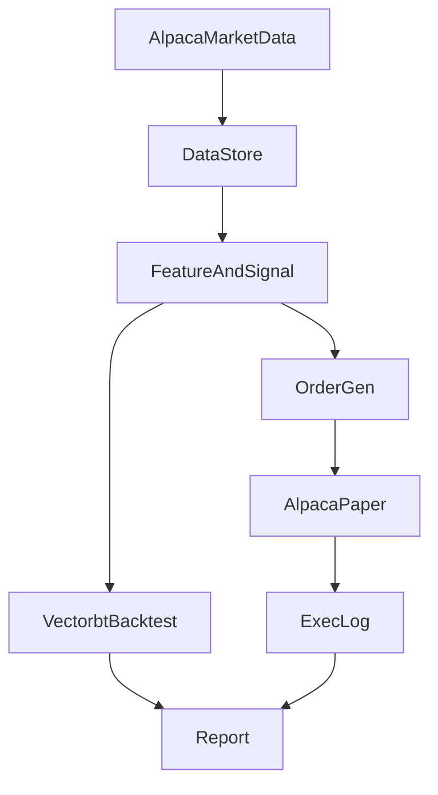

# system-trade-000 OSS活用ロードマップ（米国株 / Python+uv / Alpaca / バックテスト→ペーパートレード）

## 目的

- **“自作は最小限”**にして、既存のGitHub OSSを土台にシステムトレードを学ぶ
- 米国株・日足スイングで、**バックテスト → ペーパートレード**までを1本の流れにする

## 推奨スタック（まずはこれで進める）

- **Broker/API**: Alpaca公式SDK `alpacahq/alpaca-py`
- 参考: [alpacahq/alpaca-py](https://github.com/alpacahq/alpaca-py)
- 補足: 旧SDK `alpacahq/alpaca-trade-api-python` は新規採用は基本避ける（移行が進んでいるため）
- **バックテスト（複数銘柄にも伸ばしやすい）**: `polakowo/vectorbt`
- 参考: [polakowo/vectorbt](https://github.com/polakowo/vectorbt)
- 向いている: 日足スイングの研究/検証（ベクトル化で速い）
- **レポート/指標**: `ranaroussi/quantstats`
- 参考: [ranaroussi/quantstats](https://github.com/ranaroussi/quantstats)
- **テクニカル指標**: `twopirllc/pandas-ta`（純Pythonで導入しやすい）
- 参考: [twopirllc/pandas-ta](https://github.com/twopirllc/pandas-ta)

### 代替案（必要になったら差し替え）

- **読みやすさ最優先の最小バックテスト**: `kernc/backtesting.py`
- 参考: [kernc/backtesting.py](https://github.com/kernc/backtesting.py)
- **実運用に近いイベント駆動**: `mementum/backtrader`
- 参考: [mementum/backtrader](https://github.com/mementum/backtrader)

## なぜこの推奨？（学習効率とリスクのバランス）

- **Alpaca周り**は公式SDKに寄せると、API更新・型・サンプルの恩恵が最大
- 日足スイングは「超精密な約定シミュレーション」よりも、
- データ整備（分割/配当・タイムゾーン・欠損）
- リーク対策
- OOS検証

が勝負になりやすい

- **vectorbt**は研究ループが速く、ポートフォリオ前提にも伸ばしやすい（将来の拡張に強い）

## 早期に“車輪の再発明”を止めるための方針

- 戦略ロジックは **「DataFrame in → シグナル out」** の純関数に寄せる
- バックテスト（vectorbt）にも、ペーパー運用（Alpaca発注）にも同じシグナルを流用できる
- 自作するのは **glue（接着剤）部分だけ**
- Alpacaバーを整形して保存
- シグナル生成
- 発注（ペーパー）
- ログ・レポート

## マイルストーン（目安: 6週間、前回ロードマップをOSS前提に再構成）

### Week0（最短で意思決定）: OSS PoC

- **やること**
- `alpaca-py` で 1銘柄・1期間の日足を取得
- そのデータで `vectorbt` で超簡単な戦略（例: MAクロス）を回し、損益曲線を出す
- 同じシグナルを使って Alpaca の **ペーパー**に1回だけ発注できるところまで通す
- **合格基準**
- データ→バックテスト→ペーパー発注の“導線”が1本でつながる

### Week1-2: データ品質（ここで差がつく）

- タイムゾーン、取引カレンダー、欠損、分割/配当の取り扱いを明文化
- 保存形式（CSV/Parquet）と更新（差分取得）を固める

### Week3: バックテストの型を固める

- コスト（手数料/スリッページ）・約定タイミング（翌日寄り等）の仮定を固定
- レポート（quantstats）で標準指標を毎回出す